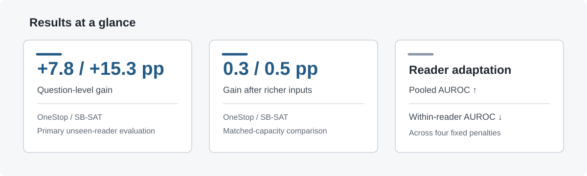
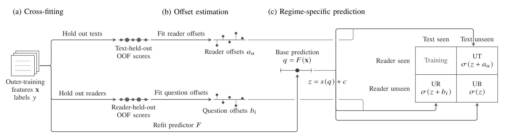
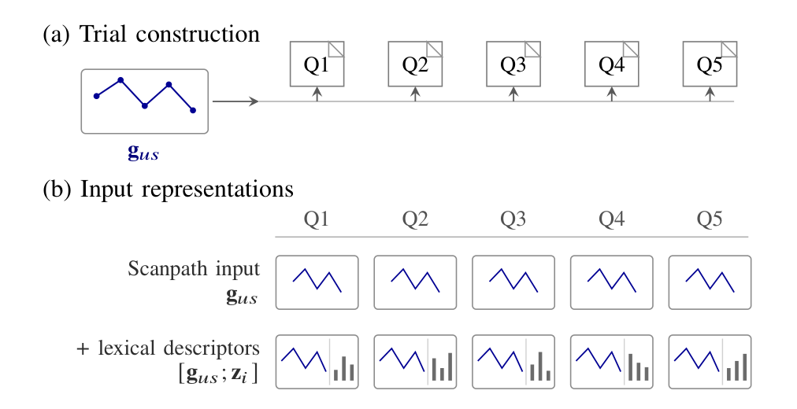
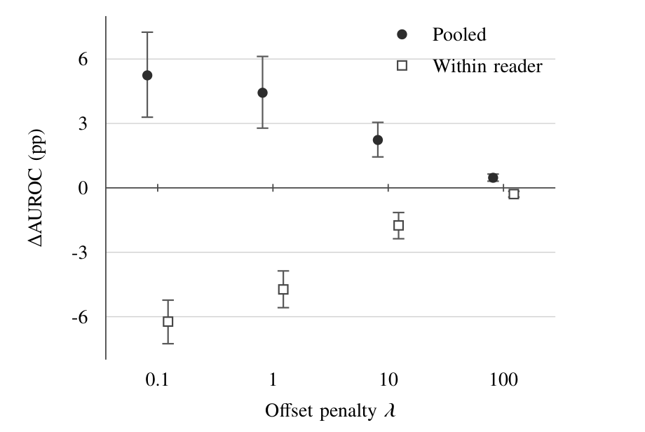
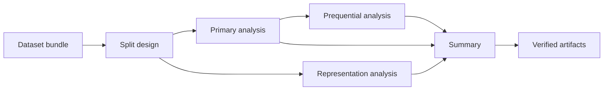

<div align="center">

# Paired Evaluation of Response Information

### Eye-tracking-based reading-comprehension prediction under reader and question reuse

**Hyunsu Go\*** · **Sumin Lee\*** · Kyeonghun Kim · Subeen Lee · Eunseob Choi · Ken Ying-Kai Liao · Nam-Joon Kim<sup>†</sup>

Seoul National University · OUTTA · GIST · NVIDIA

<sup>\*</sup>Equal contribution &nbsp;·&nbsp; <sup>†</sup>Corresponding author

[](https://github.com/gohyunsu/paired-reading-response-information/actions/workflows/ci.yml)
[](pyproject.toml)
[](results/paper_results.json)

[Overview](#overview) · [Findings](#main-findings) · [Method](#paired-evaluation) · [Results](#results) · [Reproduce](#reproduction)

</div>

---

## Overview

Evaluation protocols for reading-comprehension prediction do more than choose which observations are held out. They also determine whether correctness labels from the **same reader** or the **same question** are available in training. A single regime-level score can therefore combine two sources of performance:

1. information in the current gaze-and-text trial; and
2. regularities estimated from other labeled responses.

This project measures the second component directly. It pairs a fixed current-trial predictor with and without cross-fitted reader or question corrections on the same outer-test observations. The experiments cover **11,618 responses**, **275 readers**, and **34 texts** across OneStop and SB-SAT.

<p align="center">
  
</p>

## Main findings

- **Question reuse can account for substantial apparent performance.** In the primary analysis, adding response information for previously seen questions increases AUROC by **7.8 pp** on OneStop and **15.3 pp** on SB-SAT.
- **Question-varying inputs absorb nearly all of that gain.** Under matched model capacity, the remaining question-level gain is **0.3 pp** on OneStop and **0.5 pp** on SB-SAT.
- **Reader response history acts mainly between readers.** On OneStop, reader-level gain stays near **6 pp** across controlled input representations.
- **Forward adaptation does not improve within-reader ranking.** Earlier responses raise pooled AUROC at all four prespecified penalties, while mean within-reader AUROC decreases.

These results motivate reporting current-trial prediction separately from prediction augmented by other response labels.

## Paired evaluation

<p align="center">
  
</p>

The base predictor receives only features from the current trial. Within every outer-training partition, two cross-fitting paths produce out-of-fold scores:

- text-held-out scores estimate regularized **reader offsets**;
- reader-held-out scores estimate regularized **question offsets**.

The selected predictor is then refitted on the full outer-training set. Base and augmented predictions share this predictor and the same test observations; only the offset supported by the evaluation regime differs.

| Regime | Held out | Response information available | Augmentation |
|---|---|---|---|
| Unseen text (UT) | Complete text | Other responses from the same reader | Reader offset |
| Unseen reader (UR) | Reader | Other responses to the same question | Question offset |
| Unseen reader and text (UB) | Both | Neither | No group offset |

Model family, feature view, and regularization are selected inside a nested reader-by-text evaluation. See [Method details](docs/method.md) for the estimand, split construction, selection logic, and uncertainty procedure.

## Results

### Primary paired comparison

The table reports the mean outer-split AUROC of the selected base predictor and the gain after adding the regime-appropriate offset. Intervals use a reader-by-text bootstrap of saved predictions.

| Dataset | Regime | Base AUROC | Gain (pp) | 95% interval (pp) |
|---|:---:|---:|---:|---:|
| OneStop | UT | 0.561 | **+5.9** | [3.0, 9.0] |
| OneStop | UR | 0.621 | **+7.8** | [5.5, 10.2] |
| SB-SAT | UT | 0.564 | +1.0 | Not estimable |
| SB-SAT | UR | 0.542 | **+15.3** | [7.2, 22.6] |

### Where does the question-level gain come from?

<p align="center">
  
</p>

SB-SAT associates five question responses with one reader–story scanpath. The controlled analysis asks whether the question correction still helps once the current-trial representation distinguishes those questions. Every arm uses the same RF/ExtraTrees candidates and base-first selection.

| Dataset | Input progression | Question gain (pp) | Reader gain (pp) | Reduction from baseline (pp) |
|---|---|---:|---:|---:|
| OneStop | Joint baseline | +7.7 | +6.0 | — |
|  | + question hash | +1.8 | +6.0 | 5.9 |
|  | + option hash | **+0.3** | +6.0 | **7.3** |
| SB-SAT | Scanpath | +15.6 | +0.5 | — |
|  | + lexical descriptors | **+0.5** | +3.2 | **15.1** |

### What does reader adaptation improve?

<p align="center">
  
</p>

The prequential analysis predicts each OneStop response before revealing its label, using only earlier responses from that reader. Across **7,918 trials from 180 readers**, pooled discrimination improves, but ranking among trials from the same reader does not.

| Offset penalty | Pooled gain (pp) | Mean within-reader gain (pp) |
|---:|---:|---:|
| 0.1 | +5.24 | −6.23 |
| 1 | +4.43 | −4.73 |
| 10 | +2.23 | −1.75 |
| 100 | +0.47 | −0.29 |

Complete unrounded values, intervals, seeds, candidate grids, and artifact hashes are available in [`results/paper_results.json`](results/paper_results.json). A fuller interpretation is provided in [Results and interpretation](docs/results.md).

## Experimental design

| | OneStop | SB-SAT |
|---|---:|---:|
| Responses | 9,718 | 1,900 |
| Readers | 180 | 95 |
| Text groups | 30 articles | 4 stories |
| Correct responses | 81.2% | 56.3% |
| Outer folds per axis | 5 | 4 |
| Primary candidates | 39 | 26 |

Reader and text identifiers are assigned to folds without labels. Their Cartesian product produces 25 OneStop and 16 SB-SAT outer splits. Training for each split excludes every row associated with its held-out reader fold or text fold. Preprocessing and both selection stages are fitted within the corresponding training partition.

## Reproduction

### 1. Install

Python 3.10–3.13 is supported. The archived runs used Python 3.10.20.

```bash
git clone https://github.com/gohyunsu/paired-reading-response-information.git
cd paired-reading-response-information
python -m venv .venv
source .venv/bin/activate
python -m pip install --upgrade pip
python -m pip install -e '.[test]'
```

### 2. Prepare the datasets

Obtain [OneStop](https://osf.io/2prdq/) and [SB-SAT](https://github.com/ahnchive/SB-SAT) from their original releases, then construct the feature bundle described in [Data preparation](docs/data.md). Dataset files are not redistributed here.

### 3. Run the analyses

```bash
# Label-independent outer assignments
paired-eval design --bundle /path/to/bundle --output outputs/design

# Primary nested analysis
paired-eval primary \
  --bundle /path/to/bundle \
  --design outputs/design \
  --output outputs/primary

# Matched-capacity representation analysis
paired-eval representations \
  --bundle /path/to/bundle \
  --design outputs/design \
  --onestop-qa /path/to/onestop_qa.json \
  --sbsat-stimuli /path/to/combined_stimulus.csv \
  --output outputs/representations

# Reader-wise forward evaluation
paired-eval prequential \
  --design outputs/design \
  --primary outputs/primary \
  --trial-order /path/to/onestop_trial_order.csv \
  --output outputs/prequential

# Aggregate and validate
paired-eval summarize \
  --primary outputs/primary \
  --representations outputs/representations \
  --prequential outputs/prequential \
  --output outputs/summary.json
paired-eval verify-release
```

Long-running cells are restartable and checksum-validated. Set `--workers` and `--threads` to match the available compute. The [Reproduction guide](docs/reproduction.md) explains the output contracts and verification sequence.



## Repository map

```text
.
├── assets/                 Project figures
├── results/                Machine-readable reported values
├── docs/                   Method, results, data, and reproduction guides
├── scripts/                Deterministic result-summary rendering
├── src/paired_eval/        Evaluation implementation and CLI
└── tests/                  Synthetic unit and release-integrity tests
```

The tests do not require either eye-tracking dataset:

```bash
pytest -q
paired-eval verify-release
```

## Citation

If this repository supports your work, please cite the manuscript:

```bibtex
@inproceedings{go2026paired,
  title     = {Paired Evaluation of Reader- and Question-Level Response Information for Eye-Tracking-Based Reading-Comprehension Prediction},
  author    = {Go, Hyunsu and Lee, Sumin and Kim, Kyeonghun and Lee, Subeen and Choi, Eunseob and Liao, Ken Ying-Kai and Kim, Nam-Joon},
  booktitle = {IEEE International Conference on Consumer Electronics--Asia},
  year      = {2026}
}
```

Machine-readable citation metadata are provided in [`CITATION.cff`](CITATION.cff).

## Acknowledgments

This work was supported by the SNU Student-Directed Education Undergraduate Research Program through Seoul National University (2026), the IITP AI Semiconductor Program, and the ANCHOR Program funded by the Korean government and the Seoul Metropolitan Government (IITP-2023-RS-2023-00256081; 2026-ANCHOR-01-110).
